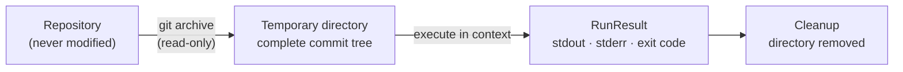

<div align="center">

# rewinds

**Run any file from any commit, without touching your working tree.**

[](https://pypi.org/project/rewinds/)
[](https://pypi.org/project/rewinds/)
[](LICENSE)
[](pyproject.toml)

[Installation](#installation) · [Usage](#usage) · [Commands](#commands) · [API Reference](#api-reference) · [Design](#design) · [Roadmap](#roadmap) · [FAQ](#faq)

</div>

---

## Overview

rewinds executes a file as it existed at any point in a repository's history.

The file, along with the complete tree of the target commit, is extracted
into a temporary directory and executed there. The working tree, the index,
and any uncommitted changes are never modified.

Two problems motivate the design:

1. **Reproduction.** Running a historical file requires more than the file
   itself. It requires its neighbors: imports, configuration, and data
   relative to the same commit. `git show` retrieves a file, but cannot
   execute it in context. rewinds reconstructs the full context.

2. **Attribution.** When a script's output changes without explanation, the
   question is which commit changed it. Conventional bisecting requires a
   test that returns good or bad. rewinds bisects on observable behavior
   instead: exit code and output.

Extraction uses `git archive`, a read-only operation. This makes the
guarantee structural rather than procedural: rewinds cannot alter the
working tree, because the commands it runs are incapable of it.

---

## Installation

```bash
pip install rewinds
```

From source:

```bash
pip install git+https://github.com/MadeByFulvo/rewinds.git
```

Or run directly from a checkout without installing:

```bash
python -m rewinds run calc.py @HEAD~2
```

**Requirements:** Python 3.9 or later, `git`, and `tar`. rewinds has no
package dependencies.

---

## Usage

```bash
rewinds run <file> <ref> [args...]
```

`ref` accepts any commit-ish expression: a full or abbreviated sha, a tag, a
branch name, or a relative expression such as `HEAD~40`. An optional leading
`@` is accepted and stripped, so refs are easy to identify visually. An
alternative argument form, `<ref>:<file>`, is also supported.

The file is executed inside the extracted tree with the current interpreter.
Standard output, standard error, and the exit code are passed through
unchanged, so rewinds composes with pipes, compound commands, and CI systems
in the same way as any direct invocation.

Every run is time-limited. The default limit is 120 seconds and can be
overridden per invocation.

---

## Commands

### run

```bash
rewinds run <file> <ref>
```

Executes a file as it existed at a commit. Additional arguments are passed
through to the file.

| Flag | Description |
|------|-------------|
| `--timeout <seconds>` | Execution time limit. Default 120. |
| `--keep` | Retain the temporary extraction directory for inspection. |
| `--repo <path>` | Operate on the repository at the given path. Defaults to the current directory. |

### show

```bash
rewinds show <file> <ref>
```

Prints a historical file to standard output without executing it.

### bisect

```bash
rewinds bisect <file> --good <ref> [--bad <ref>] [--expect <string>]
```

Runs the file at every commit between the known-good and known-bad refs and
reports the first commit at which behavior changed. `--bad` defaults to
`HEAD`.

Behavior is judged by two signals:

| Signal | Interpretation |
|--------|----------------|
| Exit code becomes nonzero | The file began failing at this commit |
| stdout stops containing `--expect` | The file runs but produces incorrect output |

Files with an unsupported extension are skipped rather than treated as
failures. The command exits `1` when a culprit is identified and `0`
otherwise, which allows direct use in CI pipelines and shell scripts.

---

## API Reference

All functionality available through the CLI is importable.

| Export | Module | Description |
|--------|--------|-------------|
| `extract_tree(repo, ref)` | `rewinds.extract` | Extract a commit's full tree into a temporary directory. Returns an `Extraction`. |
| `extract_file(repo, ref, path)` | `rewinds.extract` | As `extract_tree`, after verifying the file exists at the ref. |
| `resolve_ref(repo, ref)` | `rewinds.extract` | Resolve any accepted ref form to a full sha. |
| `Extraction` | `rewinds.extract` | Handle for an extracted commit. `.target(path)` locates a file; `.cleanup()` removes the directory. |
| `run_file(extraction, path, ...)` | `rewinds.runner` | Execute a file within the extraction. Returns a `RunResult`. |
| `RunResult` | `rewinds.runner` | `exit_code`, `stdout`, `stderr`, and an `ok` property. |
| `bisect(repo, path, good, ...)` | `rewinds.bisect` | Behavior bisect across a commit range. Returns a `BisectReport`. |
| `BisectReport` | `rewinds.bisect` | `culprit` and per-commit `steps`, with a `render()` summary. |

```python
from pathlib import Path
from rewinds.extract import extract_tree
from rewinds.runner import run_file
from rewinds.bisect import bisect

extraction = extract_tree(Path("."), "HEAD~3")
try:
    result = run_file(extraction, "scripts/pipeline.py")
finally:
    extraction.cleanup()

report = bisect(Path("."), path="calc.py", good="v1.0", expect_output="total: 100")
print(report.render())
```

---

## Design



The architecture consists of four modules:

| Module | Responsibility |
|--------|----------------|
| `rewinds/extract.py` | Ref resolution and extraction. Enforces the read-only guarantee. |
| `rewinds/runner.py` | Subprocess execution, interpreter mapping, reproducibility controls. |
| `rewinds/bisect.py` | Commit-range traversal and behavior comparison. |
| `rewinds/cli.py` | Argument parsing, output streaming, exit codes. |

### Guarantees

**Read-only.** The working tree is never written to. Extraction uses
`git archive`, which cannot modify the repository, into a temporary
directory outside it. No checkout, reset, or index operation is ever run.

**In-context execution.** The file runs inside the extracted tree. Relative
paths, sibling imports, and configuration files resolve as they did at the
source commit.

**Reproducibility.** `PYTHONPATH` is removed from the child environment so
packages installed on the host cannot leak into a historical run. The hash
seed is fixed so dictionary iteration order cannot vary results between
runs. Execution is time-limited so a hanging historical script cannot block
the caller indefinitely.

**Idempotent cleanup.** `Extraction.cleanup()` is safe to call multiple
times.

### Supported file types

| Extension | Runner |
|:---------:|--------|
| `.py` | Current Python interpreter |
| `.sh` | `sh` |
| `.bash` | `bash` |

The mapping is a single dictionary in `rewinds/runner.py`; new file types
require one line each.

---

## Roadmap

- [ ] Ephemeral virtual environments built from each commit's
      `requirements.txt`, so historical code runs against historical
      dependencies
- [ ] Lazy extraction of the import closure rather than the full tree
- [ ] Output-file comparison in bisect
- [ ] Additional interpreters

---

## Contributing

Contributions are welcome. See [CONTRIBUTING.md](CONTRIBUTING.md). The test
suite constructs real repositories in temporary directories and runs against
real git behavior, so `git` and `tar` must be available.

```bash
pip install -e .
pip install pytest
pytest tests/ -q
```

---

## FAQ

**Is the working tree safe?**

Yes. rewinds never runs `checkout`, `reset`, or any command that writes to
the working directory. Extraction is performed by `git archive`, which is
read-only with respect to the repository.

**Does it install historical dependencies?**

Not yet. Files currently run under the current interpreter. Building
ephemeral environments from each commit's dependency manifest is the first
roadmap item.

**How does this differ from git bisect?**

`git bisect` requires a test command that exits with a good or bad status,
and it checks out each candidate commit into the working tree. rewinds
requires nothing beyond the file itself, never checks anything out, and
judges behavior by what the script actually does.

**Does it work with private or large repositories?**

rewinds operates only on an existing local clone, so private repositories
work without additional configuration. Extraction is fast even on large
repositories because it neither checks out nor updates the index.

---

<div align="center">

<sub>MIT licensed. Copyright &copy; 2026 MadeByFulvo.</sub>

</div>
